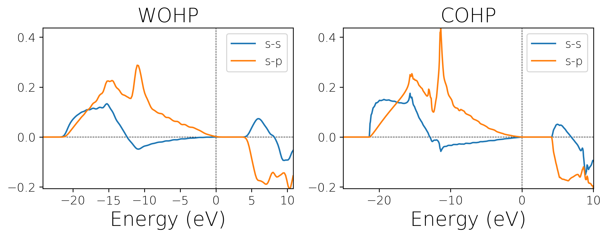

Example 1 - Diamond

This example provides a direct comparison of WOHP and COHP.
The typical workflow of WOHP:
- DFT part [DFT/DFT_input.tar.gz]
  - DFT calculation to obtain Bloch wavefunctions
  - Wannierize system

- WOHP part [`wannier90.eig` and `wannier90_u.mat` and `wannier90_hr.mat`]:
  - copy `input.py` to `\input` and run it.
  - analyze results (`WOHP_ss.dat`, `WOHP_sp.dat`)

